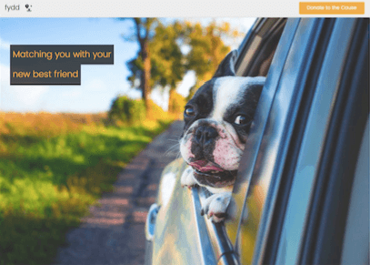
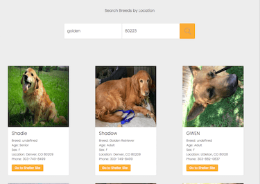
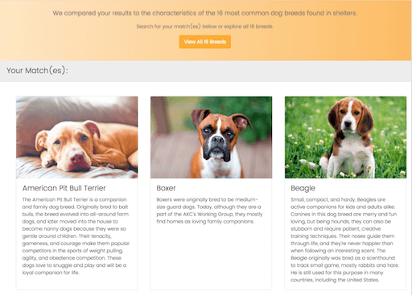

FYDD was made to help users connect with a dog breed that is compatible to their needs and desires. This app focuses on the most common dog breeds found in animal shelters, because I believe adopting a pet is far more beneficial that buying. 

This app works by asking the user a few brief questions that help identify which breeds would be right for them based on energy levels, home space, allergies, children, etc. 

They are then presented with the breeds they matched with and they can search for the breed(s) by zip code, city or state using the Petfinder api directly on the result page. 

My hope is that this app helps more dogs get adopted and more people find true companionship in a furry friend!

This app was built using HTML / CSS / Javascript and jQuery

Screen Shots:

